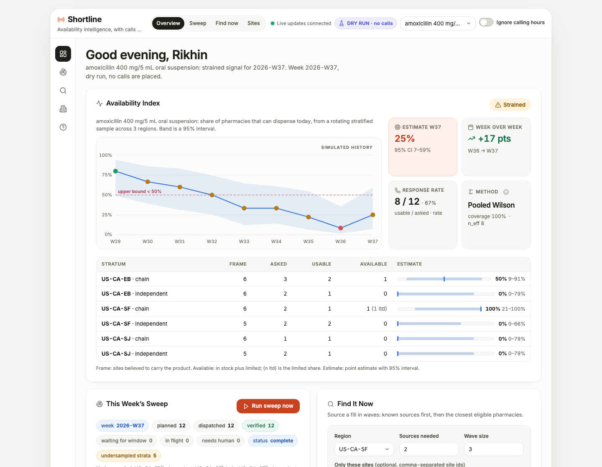

# Shortline

**Phone calls as a statistical sensor network for drug shortages.**

Shortline asks a rotating, stratified sample of pharmacies one question by phone through [CALL-E](https://www.heycall-e.com/): *can you dispense this product today?* Every answer becomes an observation only after it survives evidence checks against the transcript. The observations become a weekly **availability index with a 95% interval** per region. When someone needs the product now, the same engine runs **sourcing waves** that stop the moment enough pharmacies have confirmed stock, and every confirmation carries the pharmacy's own words.

Built for the CALL-E "Your Code Is Calling" hackathon. Dry-run by default; no call can be placed without four explicit settings.



**Hosted dry-run demo (no calls possible, shared sandbox):** <https://shortline-rikhinkavuru-9840s-projects.vercel.app/>

```
┌───────────────────────── every week ─────────────────────────┐
│  frame (all pharmacies)  →  stratified random subsample       │
│        ↓ courtesy: never in the same or previous ISO week,    │
│          local business hours only                            │
│  CALL-E batch call task, per-recipient result schema          │
│        ↓ evidence gates: quote must be a phrase the callee    │
│          said, product must have been named, staff answered   │
│  observations → Wilson intervals per stratum → weighted index │
│        ↓                                                      │
│  signal: available / strained / shortage / insufficient data  │
└───────────────────────────────────────────────────────────────┘
        ↑ fresh sightings                          ↓ uses
┌──────────── find it now ────────────┐   sites seen in stock rank first,
│ waves of 3 → stop at K confirmed    │   sites seen out are skipped,
│ answers update the sightings cache  │   nobody is dialled twice,
│ and the frame, never the index      │   nothing in flight is re-dialled
└─────────────────────────────────────┘
```

## Why

- Active US drug shortages rose for the third straight quarter, to **227 in Q2 2026**, after an all-time high of 323 in early 2024 ([ASHP / University of Utah Drug Information Service](https://www.ashp.org/drug-shortages/shortage-resources/drug-shortages-statistics), [AJMC summary](https://www.ajmc.com/view/active-us-drug-shortages-rise-for-third-straight-quarter)). National lists are national and binary: they say a shortage exists, not whether the pharmacy across the street can fill a prescription this afternoon.
- ASHP's shortage surveys describe pharmacy teams spending on the order of 20 staff-hours a week managing shortages on average, a full-time job at 300 beds and more ([ASHP survey coverage](https://www.ashp.org/drug-shortages/shortage-resources/drug-shortages-statistics)). Much of that time is phone work: wholesalers, sister hospitals, and retail pharmacies, one call at a time.
- Pharmacies have no inventory API. The phone is the API. Street-level availability has only ever been measured by hand in one-off phone audits; nobody runs it continuously, with sampling and intervals.

Shortline treats each call as a **measurement** with known noise (voicemail, menus, refusals, wrong numbers, extraction errors) and designs around it: sampling instead of census, intervals instead of point claims, courtesy as a property of the sampling design rather than a rate limiter bolted on.

Does the interval mean anything? `npm run eval` replays 10,000 simulated weeks against a population with known truth (one second, no network):

| Claim | Measured |
| --- | --- |
| 95% interval covers the true share | 96.5% (stratified branch), 98.3% (pooled branch), 97.6% overall |
| False shortage at a true share of 0.556, upper-bound rule vs naive point rule | 0.4% vs 27.2% |
| Detection at a true share of 0.444, same two rules | 3.8% vs 65.3% (the price of precision at a panel of 3) |
| Bias from fabricated in-stock quotes at a 10% rate, evidence gate on vs off | +0.029 vs +0.052 |

Details and the honest reading of each row: `docs/eval.md`.

## Who is called, and why it is acceptable

- Published pharmacy business lines only, never individuals. Shortline has no consent record for calling a person and therefore cannot call one.
- One factual question. The assistant discloses in its first sentence that it is automated, who it calls for, that the call may be recorded, and that the pharmacy can ask not to be called again.
- Bounds, enforced in code: a sweep never asks a site about a product in the same or the previous ISO week (14 days on a weekly cadence, never fewer than 8), never calls a site for any reason within 5 days of the last call, and never dials a site with another Shortline call in flight. A sourcing request never dials a site called in the last 24 hours, never dials a site twice, and counts toward that site's rest.
- A refusal rests the site for 90 days. "Please don't call again" opts the site out of everything, permanently, with an audit row naming the call; an operator cannot undo it from the dashboard.
- Intended deployers: state health departments, hospital pharmacy networks, poison control centres, manufacturers of shortage-critical products. Each brings its own frame of pharmacies and its own accountability for the calls.

## What the judges' criteria map to

| Criterion | Where to look |
| --- | --- |
| Real world impact | *Why* above; `docs/statistics.md` for what the index can and cannot claim |
| Quality of the idea | rotating panel + evidence gates + sourcing waves fed by fresh sightings (`src/domain/`) |
| Technical implementation | official `@call-e/calle` SDK 0.7 batch calls with `recipient_result_schema`, task-level `result_schema` cross-check, idempotency keys, terminal webhooks validated on `CALL-E-Event-Id` then reconciled through an authenticated read, developer events (`src/calle/`, `src/app/`). **Verified against CALL-E on 2026-09-09 with three live sourcing calls**: `call_YlsT1pFwDVuUGlQEWIsk6Q` ("only a couple of bottles, next delivery Thursday" → `limited`, verified), `call_XAMZ5x6hkb9A0jH3PPgyaw` ("we can't give out stock information over the phone" → `refused`, not counted), `call_fMIFph9e84TopidTYraRmQ` ("plenty in stock" → `in_stock`, verified); masked snapshots, events, and observations in `docs/evidence/`, each replayed through the SDK client by `test/provider.test.ts` |
| Product experience | dashboard with live feed and transcript evidence, CLI, MCP server, portable skill (`src/server/`, `src/cli.ts`, `src/mcp/`, `skill/shortline-find/` here, `skills/shortline-find/` in the community repo) |

## Try it in two minutes (no account, no calls)

Requires Node.js 22.13 or newer (uses the built-in `node:sqlite`).

```bash
npm install
npm test           # no network, no credentials
npm run eval       # interval coverage and false-shortage rates over 10,000 simulated weeks
npm run demo       # loads 36 fictional pharmacies, simulates 8 weeks, opens the dashboard
```

Open <http://127.0.0.1:8787/>. The chart shows availability sliding from available through strained to the shortage line over eight simulated weeks; the replay is seeded, so every run shows the same history. Click **Run sweep now**. If it is outside 10:00 to 17:00 Pacific, the panel tells you so and offers **Ignore calling hours** (dry-run only, top right). Then plan and run a **Find it now** request. Click **transcript** on any observation to see the evidence quote highlighted in the callee's own words, or the reason an observation was *not* counted.

Set `SHORTLINE_FAKE_PACE_MS=1500` before `npm run demo` to watch calls progress in real time instead of completing instantly.

Every number in the fixtures is in the NANP fiction block (`555-01XX`). Live mode refuses to dial them.

In the commands below, `shortline` means `npx shortline` (or `node bin/shortline.mjs`) run from the project directory after `npm install`.

## How it works

### 1. The frame and the panel

Sites carry a region, a kind (chain, independent, hospital outpatient, wholesaler branch), an IANA timezone, and one E.164 number. Region × kind is the **stratum**. Each week `planSweep` draws a fresh random subsample per stratum from the sites that are eligible *today*:

- not opted out, and never called again after a "don't call us";
- not asked about this product in the same or the previous ISO week (`cooldownDays`, default 14, counted in whole weeks so a weekly cron never sees "13.99 days ago" and plans nothing);
- not called by Shortline for any reason within `globalMinGapDays` (default 5);
- not refused in the last 90 days; not confirmed as a wrong number; not known to not carry the product; not an operator test line.

The draw is seeded by watch and ISO week, so a crashed and restarted sweep plans the same sites.

### 2. One call task per batch

A dispatch is one CALL-E call task with up to `SHORTLINE_BATCH_SIZE` recipients. The task text is short: disclose that the caller is automated and may be recorded, navigate a phone menu if there is one, ask one question, two follow-ups, no orders, no patients, no prices. The `recipient_result_schema` is enums-first with `unknown` everywhere, plus `evidence_quote`, `answered_by`, `reached_pharmacy`, and `do_not_call_request`. See `docs/call-design.md`.

Dispatches follow the lifecycle from the CALL-E community's production guide: **reserved** (intent and idempotency key are durable) → **accepted** (call id bound) → **terminal_unverified** → **terminal_verified**, with `submission_unknown` and `needs_human` as the honest side exits. The idempotency key is derived from watch, week, and site set (or request and wave number from the ledger), never from an attempt, so a replay after a crash or a rate limit returns the original call instead of dialling twice.

### 3. Evidence gates

`classifyRecipient` decides whether an answer may enter the estimator. It is not enough for the structured result to be schema-valid:

| Check | Verdict if it fails |
| --- | --- |
| The recipient actually completed (not pending, skipped, or failed) | `not_dialled`, `recipient_failed` |
| A person answered and worked in the pharmacy | `pharmacy_not_reached`, `ivr_only`, `voicemail` |
| The assistant actually named the product (bot turns contain it) | `product_never_asked` |
| `evidence_quote` is present | `no_evidence` |
| The quote appears as a contiguous phrase in one callee turn (normalised; content words in order also accepted for ASR drift) | `evidence_unattributed` |
| The answer is one of in stock / limited / out of stock | `refused`, `no_clear_answer`, `not_in_frame` |

Unusable observations are kept and shown with their reason. They are never silently dropped and never counted as "no".

### 4. The index

Only sweep observations enter the index. Per stratum, availability (in stock or limited) gets a Wilson score interval. Strata combine with weights proportional to frame size and a finite-population correction, and the combined interval is a Wilson interval on the effective sample size implied by the design variance, so eighteen unanimous answers give an interval, never a point. When any covered stratum has fewer than two usable observations the estimator falls back to a pooled Wilson interval and says so. At demo scale (six sites per stratum, panel of three) the pooled interval is the operating estimator most weeks; the stratified path needs at least two usable answers in every stratum. The **signal** is:

- `shortage` when the *upper* bound is below the shortage line (default 50%);
- `strained` when the point estimate is below 70%;
- `insufficient_data` when fewer than `minUsable` observations survived the gates.

Coverage (share of the frame represented by strata with data), response rate, method, and effective sample size are reported next to every estimate. Details, assumptions, and limits: `docs/statistics.md`; measured coverage and error rates: `docs/eval.md`.

### 5. Find it now

A sourcing request names a product, a region, how many confirmed sources are needed, and a wave size. Planning never dials. Sites seen in stock for that product within 24 hours are returned as **known sources** without a call; sites seen out of stock within 72 hours are skipped; sites with a Shortline call in flight are skipped; the rest are ranked by freshness then distance. Each wave is its own call task, numbered from the ledger, with its own idempotency key. The loop finishes anything in flight before planning a new wave and stops at the first wave that meets the need. Sourcing answers update the sightings cache and the frame (a "we don't carry that" removes the site for that product) but never the weekly index, because they are outcome-selected. With `--ask-hold`, the assistant asks whether staff can hold one fill for pickup today; a "yes" is recorded as a **stated intention**, never as a reservation.

## Using it for real

Live mode needs all four of:

```bash
export SHORTLINE_MODE=live
export CALLE_API_KEY=iams_live_...          # dashboard.heycall-e.com/account/api-keys
export SHORTLINE_LIVE_ACK=I_UNDERSTAND_REAL_CALLS_COST_MONEY_AND_CANNOT_BE_RECALLED
export SHORTLINE_CALLER_NAME="Shortline"    # the name the assistant discloses on every call
```

Then, step by step with expected output in `docs/live-runbook.md`:

```bash
npx shortline auth-check                                   # read-only, through the SDK: client.goals.list({limit: 1})
npx shortline site add --id demo-me --name "Corner Pharmacy" --kind independent \
  --phone +1XXXXXXXXXX --region US-CA-SF --tz America/Los_Angeles --test-line   # your own phone: never sampled, never in the index
npx shortline find --watch amoxicillin-susp --region US-CA-SF --only-site demo-me --need 1 --wave 1 --yes   # one real call, to you (add --fresh to re-dial within 24h)
npx shortline evidence --dispatch dsp_...                  # masked snapshot, events, observations into docs/evidence/
npx shortline watch add --id albuterol --name albuterol --strength "90 mcg" --form inhaler --regions US-CA-SF
npx shortline sweep --watch albuterol --wait               # only sites inside their local window are dialled
npx shortline serve                                        # dashboard, webhook receiver, recovery poller
```

Set `SHORTLINE_PUBLIC_URL` to receive terminal webhooks at `/webhooks/calle`; otherwise results are collected by polling. `SHORTLINE_AUTH_TOKEN` is mandatory to serve in live mode. Real numbers come from your own site list (CSV, manual, or an NPPES export); the fixtures are fictional and refused in live mode.

Recurrence belongs to the host scheduler. Run `npx shortline sweep --watch <id>` a few times a day from cron; the sweep row and per-batch idempotency keys make every invocation safe to repeat, and only sites inside their local calling window are dialled.

`docs/evidence/` is where masked snapshots of real calls live once the first live smoke test has run (`npx shortline evidence`). Each folder holds the terminal `GET /v1/calls/{id}` snapshot in API shape with numbers replaced by fiction-block numbers, the developer events, and the observations Shortline derived.

## For agents: MCP and skill

```bash
node bin/shortline.mjs mcp        # stdio MCP server (not `npm run mcp`: npm's banner would corrupt the JSON-RPC stream)
```

Tools: `shortline_watch_status`, `shortline_list_sites`, `shortline_plan_find` (read-only, never dials), `shortline_run_find` (requires `confirm: true`; destructive annotation), `shortline_get_find`. The portable skill in `skill/shortline-find/` (published as `skills/shortline-find/` in the community repository) teaches an agent when to plan, what to show the user before confirming, and what it must never do.

## Side effects, cancellation, data

- **Calls.** Only in live mode, only from `sweep`, `find --yes`, `find-run`, the dashboard's confirm buttons, or `shortline_run_find` with `confirm: true`. Every call discloses that it is automated. Each call task costs CALL-E credit per recipient.
- **Test lines.** A site added with `--test-line` is the operator's own phone: exempt from calling windows and cooldowns so a smoke test works at any hour, allowed in sourcing requests, never sampled by a sweep and never counted in the index.
- **No cancellation of an in-flight call.** The Calls API cannot recall a call. Sweeps dispatch in batches of at most `SHORTLINE_BATCH_SIZE` (default 6) and sourcing dispatches one wave at a time so the exposure of any single decision is bounded. Stopping the process stops further dispatches; a batch already accepted completes and is reconciled on the next run.
- **No recurring jobs are created.** Recurrence is the host scheduler's job.
- **Opt-out is permanent.** A `do_not_call_request` on any call opts the site out for every watch and records which call asked; the dashboard shows "asked not to be called" instead of an undo button, and the CLI needs `--override-callee`. Operators can also opt a site out from the dashboard or `shortline opt-out`.
- **Phone numbers** live only in the `sites` table. Every log line, API response, dashboard view, MCP result, and stored transcript is masked (`+1 415 ••• 0123`).
- **Transcripts** are stored masked for `SHORTLINE_KEEP_TRANSCRIPTS_DAYS` (default 14, `0` disables) so evidence can be inspected, then purged.
- **Credentials** are read from the environment and never written anywhere.
- **Ignore calling hours** exists for dry-run demos only. In live mode the CLI and MCP refuse it and the dashboard hides it.
- **Boundaries.** Shortline asks pharmacies about stock. It gives no medical advice, never mentions a patient, never orders or pays, and is not an emergency service. See `docs/safety.md`.

## Limitations and honest caveats

- A phone answer is a report by a busy person; "in stock" means *they said so*. The evidence quote is the audit trail, not a guarantee.
- Small panels give wide intervals. That is the point of showing them. Increase `panelPerStratum` or the frame to narrow them.
- Refusals and controlled-substance policies vary. The `methylphenidate-er` fixture is paused for that reason; a refusal rests a site for 90 days.
- The frame is only as good as the site list. The fixtures are fictional. A real deployment should build the frame from a licensed pharmacy registry and verify numbers with a first sweep.
- CALL-E's `completion_confidence` is task-level, so it is recorded as context rather than used as a per-recipient gate; the transcript checks do the per-recipient work.
- Nonresponse (voicemail, refusals, menus) is reported, not imputed. If the pharmacies that do not pick up are also the ones that are out, the index leans optimistic. The response rate next to every estimate is there to be read.

## Repository layout

```
src/domain/     pure: sampling, estimator, classification, task text and schemas, waves
src/calle/      provider interface, official SDK adapter, scripted fake, fake HTTP server
src/store/      node:sqlite ledger: sites, watches, sweeps, dispatches, observations, inbox, audit
src/app/        submit-once dispatch, authoritative reconcile, estimate, sweep, find, poller, webhook, evidence export
src/server/     Hono dashboard + API + SSE + webhook receiver
src/mcp/        MCP server
src/cli.ts      CLI
skill/          portable Agent Skill (shortline-find)
fixtures/       36 fictional pharmacies (555-01XX), two watches
test/           unit, workflow, crash-safety, and SDK-parser tests; no network
docs/           statistics, safety, call design, demo script, live runbook
Dockerfile      one long-lived process for a hosted deployment (fly.toml included)
```

MIT. Built with the official `@call-e/calle` server SDK. Not affiliated with any pharmacy or manufacturer.
